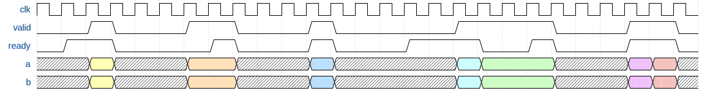

# Design Considerations GSLA multipliers

## General idea:
We will in this project investigate the following idea:  
Single cycles multipliers are large circuits as they are they trypically is designs as an adder tree, evaluation the sum of products that the multiplication can be decompose to. This is 
The context is designes/circuits with very deep pipes lines. In these circuits the clock frequency is typically low to allow for these very deep pipelines. This is seen in some low power designs, as high frequency makes for large power consumption in the clock tree.  
In these circuits one could design an asynchronous multiplier that does the sum of product with only one adder sequentially with selftimed latches. Multiple addtions should be performed in one cycle of the surroundings synchronous  The project is to inspect the benefints of this!
- Would it make for smaller circuit even with the overhead that comes from asynchronous handshake component.
- Will powerconsumption be less due to reduced leaky power.

### We want to investigate:

- Different asynchronous methods
    - 4-phase bundled data with match delay
    - 2-phase bundled data with match delay
    - Delay insensitive 4-phase dual rail 
    - Delay insensitive 2-phase dual rail
- Syncrounous single-cycle multiplication
- Syncrounous multi-cycle multiplication

### Combinatiorial circuit posibilties
- Only Full adder
    - Full adder
    - Bit shifter
    - Step latch(es)
- CSA version
    - 3-2 CSA
    - Full adder
    - Bit shifter
    - Step latch(es)

## Interfaces:
### Input Interface:

### Output Interface

## Jens comments:
Jeg forstår at I laver den "Anthon-Simon" multiplikationsenhed vi talte om. I kunne f.eks. bruge phase-decoupled click-element komponenter til den self-timede del. Og overveje om der skal være mere en et lag carry-save addere for at få bedre performance for ringen.

## Bundled data version
- 

## Dual rail

# Qs for J
- We are starting with making testbench. Is valid ready interface a good idea for handing operands and consuming result?

- Der er kommet en ack in næste clock 
    - kan vises i timing

- eller så skal man handshake eller strække clock
    - handshake tager flere cycluser - måske ikke så fedt 

- Lave simple regnestykke i det synkrone det beregner hvor mange cycluser man skal bruge på på async mult (KONSERVATIVT) 